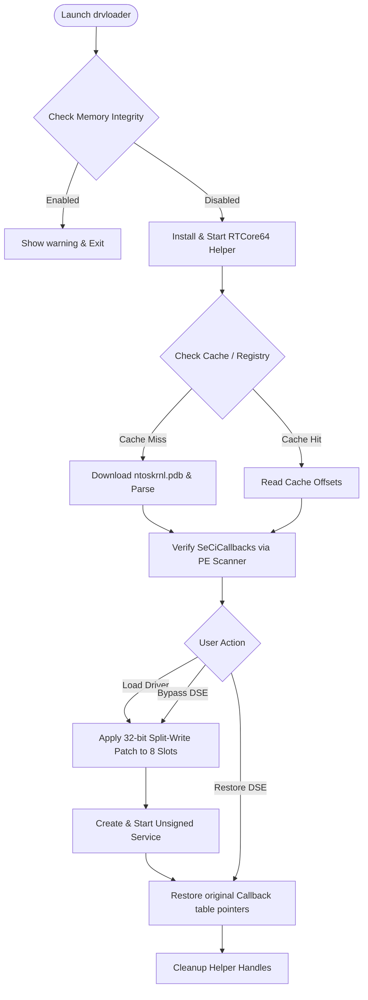

# DrvLoader - Advanced Windows 11 DSE Bypass & Driver Loader

[-blue?style=for-the-badge&logo=windows&logoColor=white)](https://github.com/CodeStartUp/KernelResearchKit)
[](https://github.com/CodeStartUp/KernelResearchKit)
[-red?style=for-the-badge)](https://github.com/CodeStartUp/KernelResearchKit)
[](https://github.com/CodeStartUp/KernelResearchKit)
[](file:///c:/Users/Lalit/OneDrive/Documents/KernelResearchKit/LICENSE)

**DrvLoader** is an advanced Windows kernel research utility designed to bypass **Driver Signature Enforcement (DSE)** on the latest builds of Windows 11 (including Build 26200+). By utilizing surgical manipulation of the kernel's Code Integrity (`CI.dll`) callback structure via the `RTCore64.sys` read/write primitive, DrvLoader enables researchers to load unsigned drivers without enabling Test Signing mode or disabling Secure Boot.

---

## 📥 Download

[](https://github.com/CodeStartUp/KernelResearchKit/releases/latest)

*   **Latest Executable**: [Download Latest Binary](https://github.com/CodeStartUp/KernelResearchKit/releases/latest)
*   **Source Code & Builds**: Review [Latest Commits](https://github.com/CodeStartUp/KernelResearchKit/commits/latest) to track recent updates and patches.

---

## 🖥️ User Interface & GUI

DrvLoader comes equipped with a highly intuitive, interactive console GUI menu, designed for rapid testing and visual monitoring of kernel patching state. 

### 1. Main Interactive Menu
When run with no arguments, DrvLoader displays the banner, validates HVCI status, initializes symbol resolution, and brings up the main menu:

```text
+----------------------------------------------------------+
|                                                          |
|               Windows driver loader                      |
|                                                          |
+----------------------------------------------------------+

DSE Bypass Tool - Universal (Dynamic PDB)
==========================================
Technique: SeCiCallbacks replacement
Driver: RTCore64 (Embedded)

=========================================================
                    AVAILABLE OPERATIONS
=========================================================
[1] Patch DSE (disable driver signature enforcement)
[2] Load unsigned driver (auto DSE patch/unpatch)
[3] Show and save offset information for external tools
[4] Exit
=========================================================

Select option:
```

### 2. Driver Management Submenu
Selecting **Option 2** launches a dedicated workspace to manage the lifecycle of your unsigned drivers, complete with driver history logs pulled from the registry:

```text
=========================================================
                  LOAD / MANAGE DRIVER
=========================================================
Recent drivers:
[1] MyUnsignedDriver (OK)
[2] TestFilter (FAIL)
---------------------------------------------------------
[L] Load new driver
[R] Reload driver (Stop -> Patch -> Start -> Restore)
[S] Stop driver (Stop service only)
[U] Remove driver (Stop service and delete)
[H] Show full history
[C] Clear history
[B] Return to main menu
=========================================================
```

### 3. External Offset Generation (Option 3)
Calculates and exports the resolved kernel offsets (`SeCiCallbacks` and safe function pointer) to third-party tools:
*   Generates config formats compatible with `drivers.ini`.
*   Saves states directly to `HKCU\Software\drvloader`.
*   Builds custom 96-byte **mini-PDBs** (`.pdb` files with matching GUID structures) allowing auto-detection by BootBypass engines.

---

## ⚙️ CLI Command Line Automation

For scripting, CI/CD, or automated virtual machine testing, DrvLoader supports a comprehensive set of command-line arguments:

| Command | Arguments | Description |
| :--- | :--- | :--- |
| **`bypass`** | None | Disables DSE system-wide by patching callback slots. |
| **`restore`** | None | Restores original kernel callback entries and enables DSE. |
| **`status`** | None | Queries and prints whether DSE is currently patched or normal. |
| **`load`** | `<path>` | Normalizes path, patches DSE, registers/starts the service, and restores DSE. |
| **`load`** | `<path> -s <0-4>` | Loads the driver with custom `StartType` (Boot, System, Auto, Demand, Disabled). |
| **`reload`** | `<driver_name>` | Stops, patches, restarts, and restores a previously loaded service. |
| **`stop`** | `<driver_name>` | Stops the driver service without deleting registry keys. |
| **`remove`** | `<driver_name>` | Stops the driver service and deletes it from SCM databases. |
| **`history`** | None | Prints full registry driver load history. |
| **`offsets`** | None | Outputs the resolved kernel addresses without pausing. |
| **`autoload`** | None | Auto-loads `iamroot.sys` if present in the executable's directory. |
| **`help`** | None or `/?` | Prints CLI usage guidelines. |

### CLI Function & Usage Examples

Here is how you can use the CLI functions to check status, bypass DSE, load/reload unsigned drivers, or view driver loading logs with actual syntax and sample terminal outputs:

#### A. Query Status of DSE
To query whether Code Integrity callbacks are currently patched:
```cmd
C:\> drvloader.exe status

[*] Querying DSE patching state...
[Status] DSE is currently ACTIVE (original callback pointers are intact).
```

#### B. Bypass DSE System-Wide
To disable driver signature enforcement manually to run multiple external testing tools:
```cmd
C:\> drvloader.exe bypass

[*] Disabling DSE system-wide...
[*] Resolving kernel symbols...
[+] Found SeCiCallbacks at offset 0xFEDCBA98
[+] Original callback state backed up to registry.
[+] Patched 8 callback slots with split-write technique.
[SUCCESS] DSE Bypassed successfully!
```

#### C. Restore DSE System-Wide
To re-enable signature enforcement after you are done testing:
```cmd
C:\> drvloader.exe restore

[*] Restoring DSE system-wide...
[+] Restored 8 callback slots to original values.
[+] Cleared registry patch state.
[SUCCESS] DSE Restored successfully!
```

#### D. Load an Unsigned Driver (Safe Automation)
To automatically patch DSE, create and start your service, and immediately restore DSE to minimize security exposure:
```cmd
C:\> drvloader.exe load C:\drivers\my_unsigned_driver.sys

[*] Normalizing driver path...
[*] Found driver at: C:\drivers\my_unsigned_driver.sys
[*] Auto-patching DSE...
[+] Patched 8 callback slots with split-write technique.
[*] Creating driver service 'my_unsigned_driver'...
[+] Service created successfully.
[*] Starting driver service...
[+] Service started successfully.
[*] Auto-restoring DSE...
[+] Restored 8 callback slots.
[SUCCESS] Driver loaded successfully!
```

#### E. Reload a Running Driver
To reload a modified version of your driver during development (this automatically handles stopping, patching, restarting, and restoring DSE):
```cmd
C:\> drvloader.exe reload my_unsigned_driver

[*] Reloading driver: my_unsigned_driver
[*] Stopping driver service 'my_unsigned_driver'...
[+] Service stopped successfully.
[*] Auto-patching DSE...
[+] Patched 8 callback slots.
[*] Starting driver service 'my_unsigned_driver'...
[+] Service started successfully.
[*] Auto-restoring DSE...
[+] Restored 8 callback slots.
[SUCCESS] Driver reloaded successfully!
```

#### F. View Load History
To see logs of previous driver loading attempts:
```cmd
C:\> drvloader.exe history

=========================================================
                   DRIVER LOAD HISTORY
=========================================================
[1] my_unsigned_driver
    Path: C:\drivers\my_unsigned_driver.sys
    Time: 2026-06-29 13:10:00
    Result: SUCCESS
[2] test_filter
    Path: C:\test_filter.sys
    Time: 2026-06-29 13:12:00
    Result: FAILED
=========================================================
```

---

## 🔬 How It Works (System Flow)

The execution flow coordinates safety verification, symbol downloading, kernel memory writing, and automatic cleanup:



### Key Technical Innovations
1.  **32-bit Split-Write Bypass**: Microsoft's Hypervisor-protected Code Integrity (HVCI/Memory Integrity) monitors 8-byte atomic writes to key kernel callback structures. DrvLoader bypasses this detection by performing consecutive 32-bit write instructions, splitting the 64-bit address space to evade modern instrumentation.
2.  **Multi-Slot 8-Entry Coverage**: Newer builds of Windows 11 utilize multiple validation paths in `SeCiCallbacks`. DrvLoader patches the first 64 bytes (8 contiguous slots) to prevent driver load blocks (Error `0x241`).
3.  **Graceful Restoration Handler**: A Console Control Handler intercepts termination signals (`Ctrl+C`, `Close Window`, etc.) to guarantee that patched kernel callbacks are restored back to normal before the program exits, preventing BSODs or persistent security vulnerabilities.

---

## 🛠️ Build & Compilation

### Requirements
*   **Visual Studio 2022** (with C++ Desktop Development components)
*   **Windows SDK** (matched to your current target build)

### Steps
1.  Clone the repository:
    ```bash
    git clone https://github.com/CodeStartUp/KernelResearchKit.git
    cd KernelResearchKit
    ```
2.  Open the Solution file `drvloader.sln` in Visual Studio 2022.
3.  Set compile configuration to **Release / x64**.
4.  Build solution (`Ctrl + Shift + B`). Output binary will be located in `\x64\Release\drvloader.exe`.

---

## ⚠️ Troubleshooting (Windows 11 Build 26200+)

*   **Error `0x241` (Driver Blocked)**: This indicates that signature checking blocked loading. Ensure you are running the latest codebase that applies the full 8-slot callback patch.
*   **Error `1072` (Service Marked for Delete)**: Typically occurs when another program (e.g. SCM, Process Hacker, Services.msc) holds open handles to the driver. Close these utilities and re-run DrvLoader; if it persists, restart the OS.
*   **Bypass Failures**: Verify that **Memory Integrity (HVCI)** is fully disabled in Windows Security under *Device Security -> Core Isolation*.

---

## ⚖️ Disclaimer

**FOR EDUCATIONAL AND SECURITY RESEARCH PURPOSES ONLY.**
This repository demonstrates technical concepts related to Windows internals, kernel-level callbacks, and security policies. The developer assumes no liability for damages, misuse, system corruption, or software failures caused by executing this code. Always verify behaviour on isolated virtual machines.

